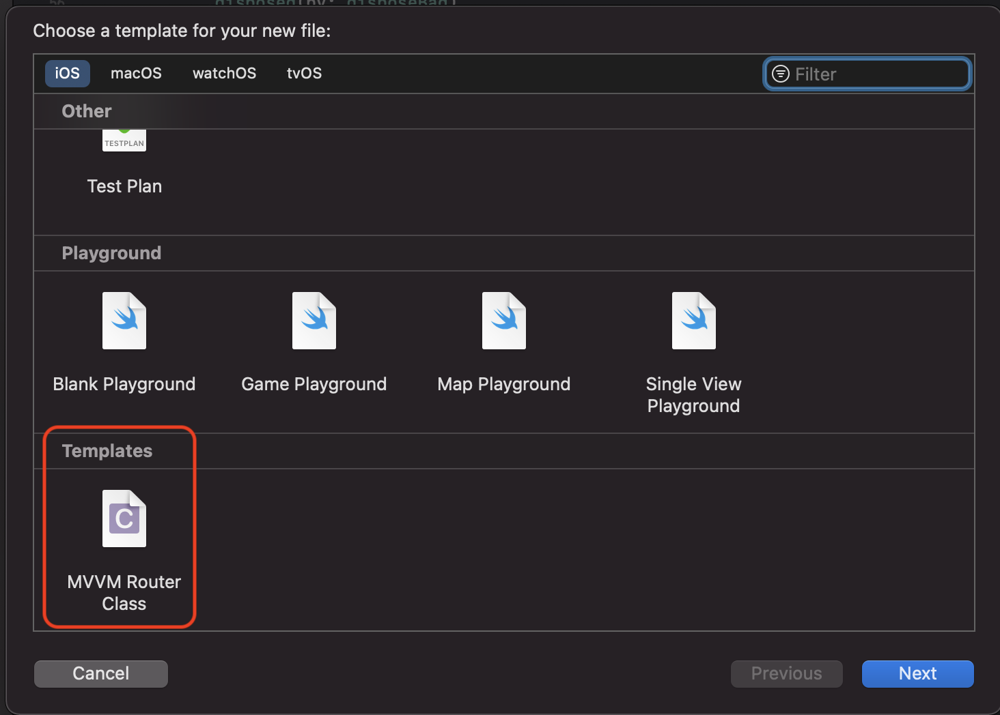
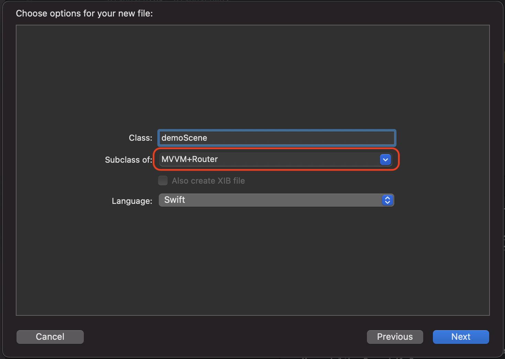
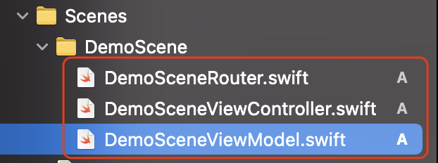

Mercadolibre Search
============================================

App de prueba para servicio Search de la API Meli.

# Herramientas Base

- `SwiftGen` para menejo de referencias de Storyboard.
- `SwiftLint` para validacion del estilo de codeo.
- `RxSwift` para manejor flujo de data.
- `Alamofire` Para networking.
- `Cocoapods` para manejo de dependencias.

# Uso

1. Clona este repo en tu computador.
2. Abre la terminal.
3. Navega en la terminal hasta la carpeta del proyecto.
4. Corre el comando `pod install`.
5. Abre el el archivo `MercadolibreSearch.xcworkspace`
6. Build

# Configuracion para Desarrollar.

### Xcode Template de Arquitectura.
1. Abre del proyecto en la carpeta `tools/mvvm Xcode template`.
2. Corre el script `addTemplate.command` para Agregarlo a tus custom templates.

# Creando Scene de MVVM + Router
1. Crea una carpeta dentro de `Scenes`.
2. Crear un archivo.
3. buscar la seccion de template y seleccionar `MVVM Router Class`.

4. Asegurar que se seleccione `MVVM+Router` en `Subclass of:`.

5. Se crean los 3 archivos para la scenea el `ViewController`, `ViewModel`, `Router`. 

# Architecture
Estamos usando MVVM + Router.

## Models
Se usa para almacenar los datos de la App.

## Views
Los `Views` (o `ViewControllers` para este caso) solo se encarga de mostrar la informacion proveída por el `ViewModel` y transmitir los eventos al `ViewModel`.

## ViewModel
El `ViewModel` es el componente encagado de manejar el estado de cada `View` y procesar la data necesaria para mostrar o transmitir.

## Services
Estos son los encargados del manejo de los `Models` esto se hace via 2 clases, uno para definir el protocolo de comunicacion entre ellos y el otro para la implementacion que en este caso se ocupa via `Alamofire`, 

## Router
Este es el encargado de toda la logica de navegación entre vistas, con la ayuda del `SwiftGen` para la instancia de las vistas.
